# Проектная работа 9 спринта (кейс BionicPRO)

## Исходная проблема
Компанию взломали через уязвимость SSO. Утекли персональные данные пользователей. Необходимо усилить безопасность, обеспечить мультистрановую аутентификацию и изолировать доступ к данным.

## 1. Повышение безопасности системы
### 1. Предложить архитектурное решение и доработать диаграмму C4 для управления учётными данными пользователя
Для усиления безопасности системы необходимо:
- Создать новый сервис Auth Gateway - единый сервис аутентификации и авторизации, объединяющий функции BFF, IdP-роутера и менеджера токенов, который реализует в себе:
  - прием authorization code пользователей мобильного приложения и интернет-магазина
  - валидация PKCE (code_challenge / code_verifier)
  - маршрутизация аутентификации к нужному Identity Provider (IdP) в зависимости от страны пользователя
  - обмен authorization code на токены IdP
  - генерация internal JWT access token с TTL, и internal refresh token
  - валидация токенов по запросу от API-сервиса
  - refresh token rotation (одноразовое использование refresh token, старый попадает в blacklist)
- В качестве хранилища токенов использовать Redis. Хранилище реализует следующие функции:
  - хранение refresh токенов
  - хранение связки "internal refresh token → IdP refresh token"
  - token blacklist для отозванных токенов
  - автоудаление просроченных токенов по TTL
- Использовать внешние Identity Providers (за пределами системного контекста) для:
  - аутентификация через OAuth 2.0 + OIDC
  - хранения credentials пользователей происходит в соответствующем регионе
- Изменить процесс создания передачи заказа из интернет-магазина напрямую в CRM: необходимо создавать заказ в API с токеном в запросе и далее после проверки в API заказ передается в CRM

Таким образом будет реализован стандартный паттерн zero-trust архитектуры — никто не доверяет никому без токена, даже внутри периметра.

[Схема TO-BE](BionicPRO_C4_model_new.drawio)

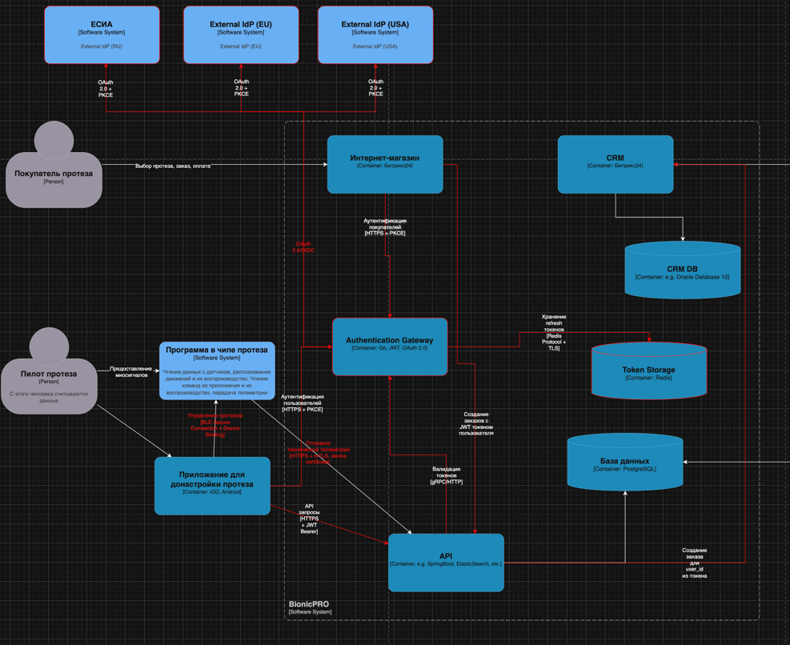

### 2. Улучшить безопасность существующего приложения, заменив Code Grant на PKCE
В рамках необходимых изменений было сделано:
- **PKCE flow** реализован в бэкенде **bionicpro-auth** (Go): при редиректе на Keycloak формируются `code_verifier` и `code_challenge` (S256), при обмене кода передаётся `code_verifier` (`oauth2.GenerateVerifier`, `S256ChallengeOption`, `VerifierOption`).
- в realm для keycloak включён `standardFlowEnabled`; Keycloak принимает запросы с PKCE от confidential client.

В Keycloak 21.1 для публичных клиентов PKCE поддерживается автоматически, если клиент его использует.
Как это работает:
- bionicpro-auth при редиректе на Keycloak генерирует code_verifier и добавляет code_challenge (S256) в auth-запрос
- Keycloak принимает и сохраняет challenge
- При callback bionicpro-auth обменивает code на токены, передавая code_verifier
- Keycloak проверяет соответствие

Если нужно сделать PKCE обязательным на стороне сервера (отклонять запросы без PKCE), то это необходимо настроить через Admin Console после запуска (Realm Settings -> Client polices -> создается политика с добавлением экзекьютора pkce-enforcer).
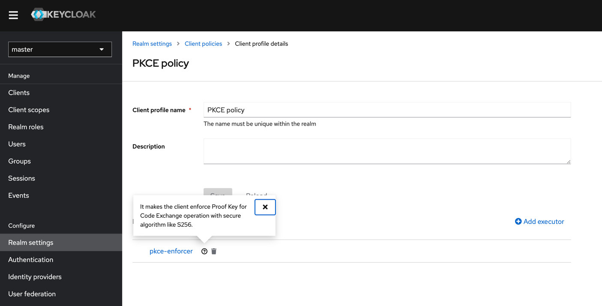

### 3. Обеспечить безопасное получение и хранение access-и refresh-токенов
В рамках задания реализован сервис `bionicpro-auth` (Go): 
- интегрирован с Keycloak
  - OAuth2/OIDC Authorization Code flow
  - создан confidential client `bionicpro-auth` в Keycloak
  - задан TTL токенов: access_token TTL = 2 минуты, refresh_token TTL = 30 минут
- позволяет безопасно хранить Access-токены и Refresh-токены с помощью Redis
- привязывает токены к сессии через Session ID
- HTTP-only Secure cookies для фронта
- автоматически обновляет Access-токен через Refresh-токен по истечению TTL сессии (TTL сессии больше, чем у Access-токена)
- ротирует Session ID при каждом запросе (старый удаляется, новый создается, куки обновляется автоматически)

**API**
- `GET /auth/login` - редирект на Keycloak для авторизации
- `GET /auth/callback` - обработка OAuth callback от Keycloak
- `GET /auth/logout` - выход и очистка сессии
- `GET /auth/me` - информация о текущем пользователе
- `GET /api/reports` - прокси к API с автоматической подстановкой access_token

**Измененения фронта:**
- удалена прямая интеграция с Keycloak (keycloak-js)
- все запросы идут через бэкенд с использованием cookies
- автоматическая обработка истечения сессии

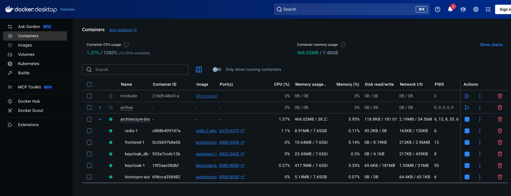

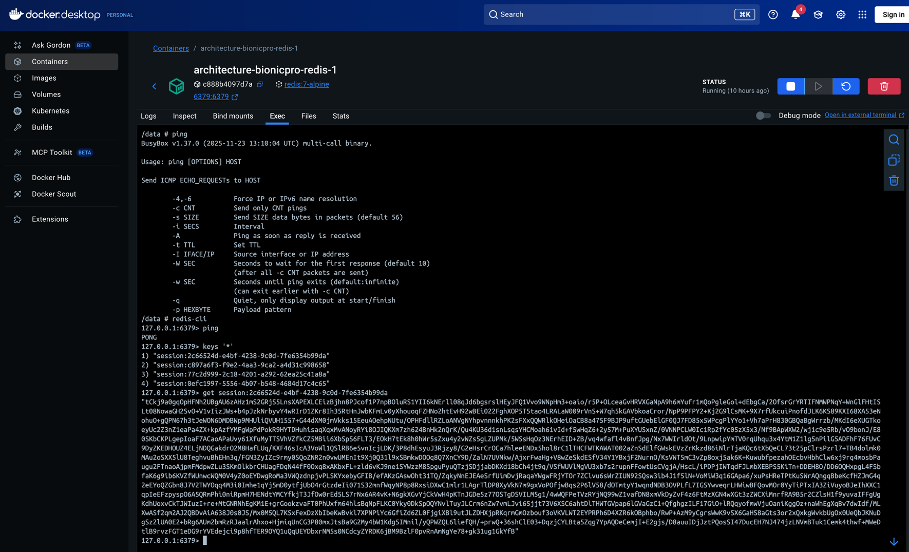

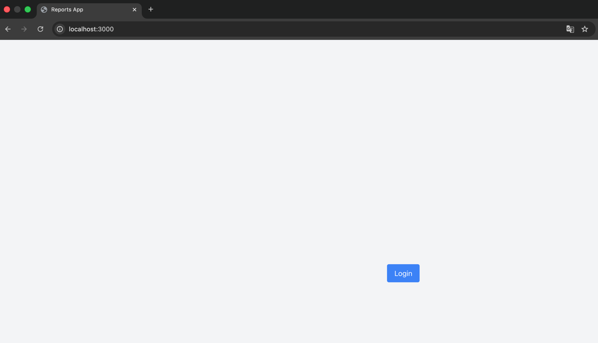

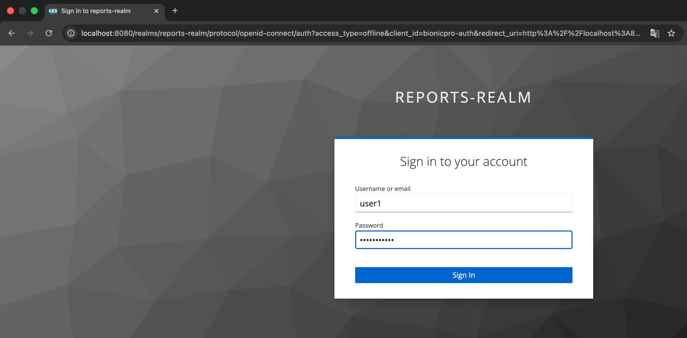

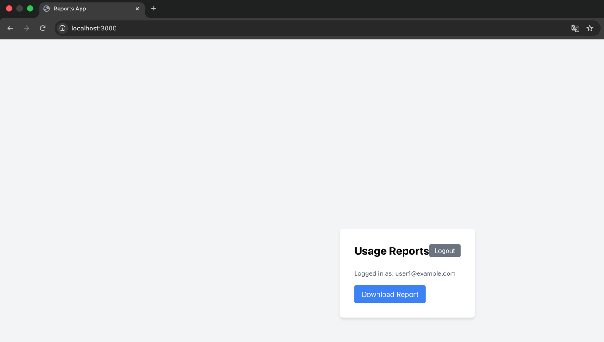

### 4. LDAP для пользователей представительства в другой стране

- **OpenLDAP** развёрнут в Docker (сервисы `openldap` и `ldap-bootstrap`)
- Данные пользователей и групп загружаются из **ldap/config.ldif**:
  - OU: `ou=People`, `ou=Groups`, база `dc=example,dc=com`
  - Пользователи: john.doe, jane.smith, alex.johnson (пароль `password`)
  - Группы (роли): `user`, `prothetic_user` — совпадают с именами realm roles в Keycloak для маппинга.
- Настройка Keycloak (User Federation + маппинг ролей LDAP → Realm Roles) описана в **[keycloak/LDAP-SETUP.md](keycloak/LDAP-SETUP.md)**.
- Маппинг ролей: группы LDAP `cn=user` и `cn=prothetic_user` сопоставляются с realm roles **user** и **prothetic_user**, чтобы роли разных представительств BionicPRO были едиными.

### 5. OAuth 2.0 / Identity Brokering: Яндекс ID

- Аутентификация через внешний IdP **Яндекс ID** (OAuth 2.0) настроена через Keycloak **Identity providers** (OpenID Connect v1.0 с URL Яндекса).
- Пошаговая настройка: **[keycloak/YANDEX-ID-SETUP.md](keycloak/YANDEX-ID-SETUP.md)** (регистрация приложения в Яндекс OAuth, Redirect URI для брокера, маппинг атрибутов).
- **Согласие пользователя**: для клиента **bionicpro-auth** включён **Consent Required** — после входа (в т.ч. через Яндекс) пользователь подтверждает разрешение на использование данных.
- **Сохранение профиля в БД**: сервис **bionicpro-auth** при входе через Яндекс (`identity_provider == "yandex"`) сохраняет профиль (sub, email, имя, фамилия и т.д.) в SQLite-таблицу `user_profiles` (файл задаётся через `PROFILE_DB_PATH`, по умолчанию `./data/profiles.db`; в Docker — том `./bionicpro-auth-data`).

### 6. MFA (OTP)

- Включение обязательного одноразового пароля (Google Authenticator / FreeOTP) описано в **[keycloak/MFA-SETUP.md](keycloak/MFA-SETUP.md)**.
- Шаги: дублирование потока Browser → в подпотоке Forms шаг **OTP Form** перевести в **Required** → привязать новый поток к **Browser flow** → при необходимости включить Required Action **Configure OTP** как Default action.

---

## Запуск и проверка сервисов (Docker)

1. **Поднять все сервисы** (из корня репозитория):
   ```bash
   docker compose up -d --build
   ```
   Сервисы: keycloak_db, keycloak, redis, openldap, ldap-bootstrap, bionicpro-auth, olap_db, reports-api, frontend.

2. **Проверить, что контейнеры запущены**:
   ```bash
   docker compose ps
   ```
   Все сервисы должны быть в состоянии `running` (ldap-bootstrap — `exited 0`).

3. **Проверка доступности** (скрипт):
   ```bash
   chmod +x scripts/verify-services.sh
   ./scripts/verify-services.sh
   ```
   Скрипт проверяет: Keycloak (http://localhost:8080), bionicpro-auth (http://localhost:8000/auth/login → 302), Frontend (http://localhost:3000), Redis (ping).

4. **Ручная проверка**:
   - Keycloak: открыть http://localhost:8080 (админ: admin / admin).
   - Вход в приложение: http://localhost:3000 → Login → редирект на Keycloak, после входа — обратно на фронт.
   - bionicpro-auth: http://localhost:8000/auth/me без cookie → 401; с сессией после логина → 200 и JSON с пользователем.

Если при сборке **bionicpro-auth** падает из‑за `go.sum`, в каталоге `bionicpro-auth` выполните `go mod tidy` и повторите `docker compose build bionicpro-auth`.

**Критерии приёмки:**

| Критерий                                             | Где                                                                                                                                      |
|------------------------------------------------------|------------------------------------------------------------------------------------------------------------------------------------------|
| Диаграмма архитектуры в draw.io                      | [BionicPRO_C4_model_new.drawio](BionicPRO_C4_model_new.drawio)                                                                           |
| Код, реализующий PKCE flow                           | [bionicpro-auth/main.go](bionicpro-auth/main.go) — `handleLogin` (code_verifier, S256ChallengeOption), `handleCallback` (VerifierOption) |
| Бэкенд-сервис (access/refresh-токены, сессия)        | [bionicpro-auth/](bionicpro-auth/)                                                                                                       |
| Фронтенд работает с сессиями (без Keycloak напрямую) | [frontend/src/components/ReportPage.tsx](frontend/src/components/ReportPage.tsx) — `/auth/login`, `/auth/me`, `credentials: 'include'`   |
| Экспорт realm после настроек Keycloak                | [keycloak/keycloak-results-export.json](keycloak/keycloak-results-export.json)                                                           |
| OAuth 2.0 от Яндекс ID                               | [keycloak/YANDEX-ID-SETUP.md](keycloak/YANDEX-ID-SETUP.md), consent + сохранение профиля в bionicpro-auth                                |

## 2. Разработка сервиса отчётов

Пользователи должны иметь возможность получать данные о работе протеза и просматривать их в виде отчёта. Реализован отдельный сервис отчётов, который формирует отчёты из данных CRM и телеметрии через ETL и отдаёт их через API.

### Требования задания и выполнение

| № | Требование                                                                                                      | Что сделано                                                                                                                                                                                                                                                                                                                                                               |
|---|-----------------------------------------------------------------------------------------------------------------|---------------------------------------------------------------------------------------------------------------------------------------------------------------------------------------------------------------------------------------------------------------------------------------------------------------------------------------------------------------------------|
| 1 | **Airflow DAG**: ETL из CRM и телеметрии в OLAP, витрина по пользователям, расписание                           | DAG [airflow/dags/reports_etl_dag.py](airflow/dags/reports_etl_dag.py) (ежедневно). ETL-логика вынесена в сервис [reports-etl/](reports-etl/) (Go): загрузка в `staging_crm`/`staging_telemetry`, агрегация в [olap/init.sql](olap/init.sql) витрину `datamart_reports` (индексы по `user_id`, периоду). DAG запускает образ `reports-etl:latest` с connection `olap_db`. |
| 2 | **Бэкенд API** для отчётов: эндпоинт возвращает готовый отчёт из OLAP без тяжёлых вычислений в реальном времени | Сервис [reports-api/](reports-api/) (Go): `GET /reports` читает из `datamart_reports` по `user_id` (из заголовка `X-User-Id`), возвращает последний отчёт (JSON). Подключение к OLAP через `OLAP_DATABASE_URL` (в Docker: `sslmode=disable`).                                                                                                                             |
| 3 | **Ограничение доступа**: отчёт только по себе                                                                   | bionicpro-auth: маршрут `GET /api/reports` под middleware авторизации; в запрос к reports-api передаётся только `X-User-Id` из сессии (Keycloak `sub`). reports-api отдаёт данные только по переданному `user_id`.                                                                                                                                                        |
| 4 | **UI**: кнопка получения отчёта и вызов API                                                                     | [frontend/src/components/ReportPage.tsx](frontend/src/components/ReportPage.tsx): кнопка «Получить отчёт» → `GET /api/reports` с `credentials: 'include'`. Показ JSON-отчёта или сообщения об ошибке (404 — «Данные за период ещё не готовы»). Отображается User ID для отчётов (Keycloak `sub`) для ручного добавления данных в витрину.                                 |

**Архитектура решения**
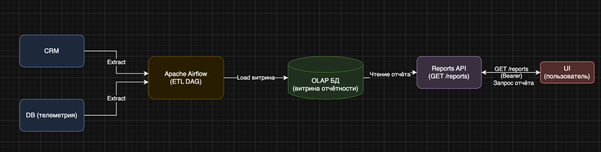

описание — [docs/REPORTS-ARCHITECTURE.md](docs/REPORTS-ARCHITECTURE.md)

### Компоненты

- **OLAP** (`olap_db`, PostgreSQL): таблицы `staging_crm`, `staging_telemetry`, витрина `datamart_reports` (user_id, period_from, period_to, summary JSONB). Инициализация — [olap/init.sql](olap/init.sql).
- **Reports API** (порт 9000): [reports-api/](reports-api/) — чтение из `datamart_reports` по `X-User-Id`; при отсутствии строки — 404 с телом `report_not_ready`.
- **reports-etl** (Go): [reports-etl/](reports-etl/) — одна команда: загрузка в staging + построение витрины за «вчера − 6 дней». Образ для Airflow: `docker build -t reports-etl:latest ./reports-etl`.
- **bionicpro-auth**: прокси `GET /api/reports` → reports-api с заголовком `X-User-Id` из сессии; при недоступности reports-api — 502.
- **Airflow**: DAG `reports_etl` вызывает контейнер reports-etl с connection `olap_db` (см. [airflow/dags/reports_etl_dag.py](airflow/dags/reports_etl_dag.py)). Airflow поднимается отдельно (порт 8081 в [airflow/docker-compose.yaml](airflow/docker-compose.yaml)).

### Как все работает

- **UI вызывает API отчётов** — кнопка «Получить отчёт» отправляет `GET /api/reports` с cookie.
- **Без аутентификации отчёт недоступен** — без сессии bionicpro-auth возвращает 401; в UI показывается экран входа.
- **Авторизованный пользователь видит только свой отчёт** — `X-User-Id` берётся из сессии на бэкенде; reports-api фильтрует по этому user_id.
- **Отчёты из OLAP** — reports-api читает только из `datamart_reports`, без расчётов на лету.
- **Только за обработанный период** — витрину заполняет ETL; при отсутствии данных API возвращает 404 с сообщением «Данные за обработанный период ещё не готовы».

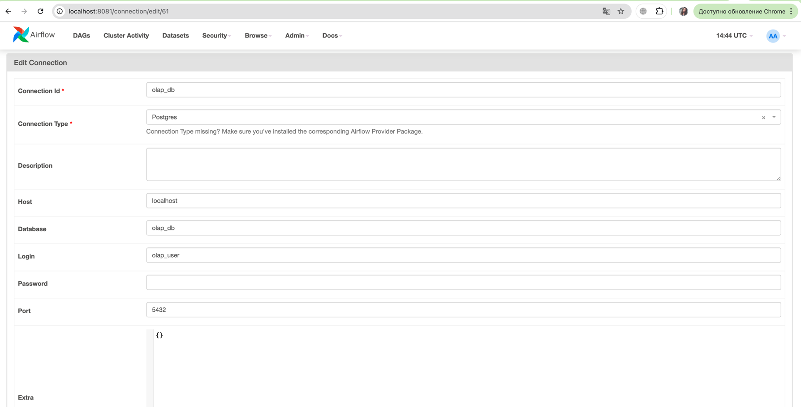

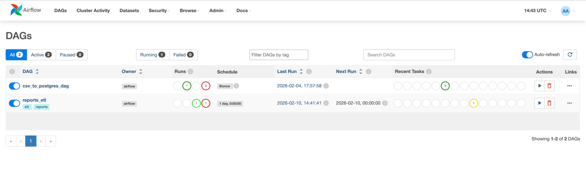

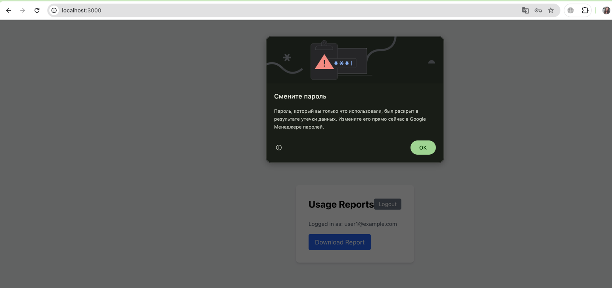

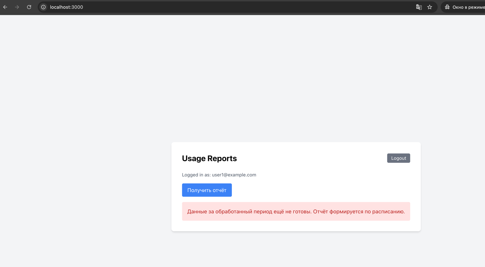

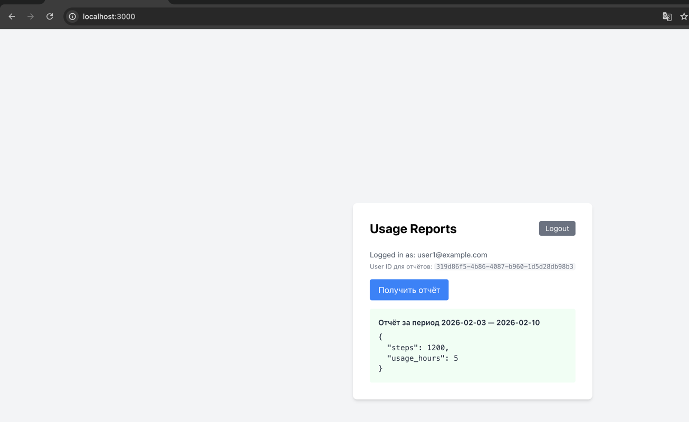


### Запуск и получение отчёта

1. Поднять все сервисы:  
   `docker compose up -d --build`
2. Войти в приложение (http://localhost:3000)
3. Нажать «Получить отчёт» — должен отобразиться JSON-отчёт, если данные уже есть в базе, либо сообщение "Данные за обработанный период еще не готовы" в противном случае

Подробнее: [docs/REPORTS-SETUP.md](docs/REPORTS-SETUP.md).

---

## 3. Снижение нагрузки на БД отчётности (S3 и CDN)

После внедрения отчётности нагрузка на OLAP выросла; данные обновляются по расписанию ETL, поэтому повторные запросы отдают один и тот же отчёт. Реализовано:

1. **Запись отчётов в S3** (Minio, S3 API): reports-api при получении отчёта из OLAP сохраняет его в объектное хранилище (бакет `reports`, ключ `reports/{user_id}/{period_from}_{period_to}.json`).
2. **Проверка S3 и выдача ссылки на CDN**: при запросе отчёта сервис сначала проверяет кеш Redis (CDN-URL). При попадании в кеш возвращает только URL без обращения к OLAP и S3. При промахе — запрос в OLAP, сохранение в S3, запись URL в Redis (TTL 5 мин), ответ с URL и телом отчёта.
3. **CDN (Nginx)**: раздача отчётов через Nginx (порт 8082) с кешированием статики (`proxy_cache`), эмуляция CDN. Проксирование `/reports/` в Minio.
4. **Обновление кеша**: при каждом обращении к OLAP отчёт перезаписывается в S3 (актуальные данные после ETL). Кеш Redis сбрасывается по TTL (5 мин). Кеш Nginx — по TTL 1 день или при очистке тома `cdn-cache`. Подробнее: [docs/REPORTS-S3-CDN.md](docs/REPORTS-S3-CDN.md).

**Компоненты:** Minio (порт 9001), сервис `cdn` (Nginx, порт 8082), переменные окружения reports-api: `S3_ENDPOINT`, `S3_ACCESS_KEY`, `S3_SECRET_KEY`, `S3_BUCKET`, `CDN_BASE_URL`, `REDIS_ADDR`.

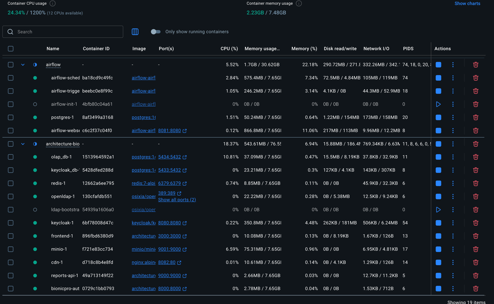

## 4. Повышение оперативности и стабильности работы CRM

CDC (Change Data Capture) для разделения потоков: выгрузки не нагружают OLTP CRM.

### Что сделано

1. **Debezium CDC**: захват изменений в таблицах CRM (`telemetry_events`, `users`) → Kafka
2. **Kafka**: топики `crm_db.public.telemetry_events`, `crm_db.public.users`
3. **ClickHouse KafkaEngine**: потребление из Kafka, парсинг Debezium JSON
4. **MaterializedView**: `mv_telemetry_to_events` → сырые события, `mv_telemetry_to_datamart` → витрина `datamart_reports`
5. **reports-api**: переведён на чтение из ClickHouse (при `CLICKHOUSE_DSN`)

### Компоненты

- **crm_db** (порт 5435): PostgreSQL с `wal_level=logical`
- **Kafka** (9092), **Zookeeper** (2181)
- **Debezium Connect** (8083)
- **ClickHouse** (8123 HTTP, 9009 native)

### Запуск

```bash
docker compose up -d --build
# Подождать ~30 сек, затем:
./scripts/register-debezium-connector.sh
```

Подробнее: [docs/CDC-CLICKHOUSE.md](docs/CDC-CLICKHOUSE.md)

---
## Запуск с нуля
```bash
# 1. Клонирование
git clone <repo-url>
cd architecture-bionicpro
git checkout <branch>

# 2. .env
echo "CLICKHOUSE_PASSWORD=clickhouse" > .env

# 3. init для Airflow (если airflow/db/init-db.sql нет в репо)
mkdir -p airflow/db
cp airflow/dags/sql/init-db.sql airflow/db/ 2>/dev/null || echo "CREATE DATABASE sample;" > airflow/db/init-db.sql

# 4. Запуск основного стека
docker compose up -d --build

# 5. Ожидание ~2 минуты
sleep 120

# 6. reports-etl образ
docker build -t reports-etl:latest ./reports-etl

# 7. Debezium connector
chmod +x scripts/register-debezium-connector.sh
./scripts/register-debezium-connector.sh

# 8. Airflow
cd airflow && docker compose up -d && cd ..
```

## Список контейнеров в Docker
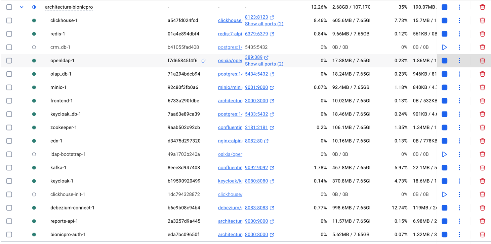

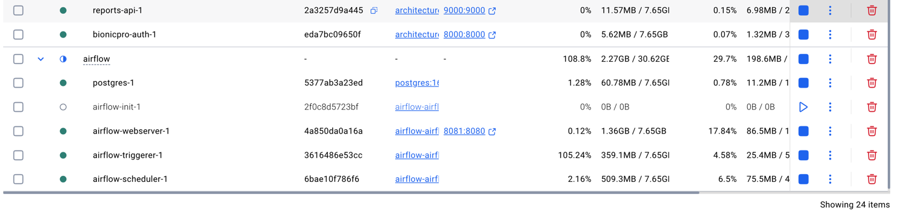

Выполнение по пунктам:
- Frontend: http://localhost:3000 (логин: user1 / password123)
- Airflow: http://localhost:8081 (admin / admin)
- Keycloak: http://localhost:8080 (admin / admin)
- В Airflow:
  - Включить DAG load_reports_seed — загрузка тестовых данных для user1
  - Включить DAG reports_etl — ETL по расписанию
  - Подключение olap_db (или как у вас): Postgres, host olap_db, порт 5432, схема из docker-compose
  - После выполнения load_reports_seed отчёт для user1 будет доступен через UI