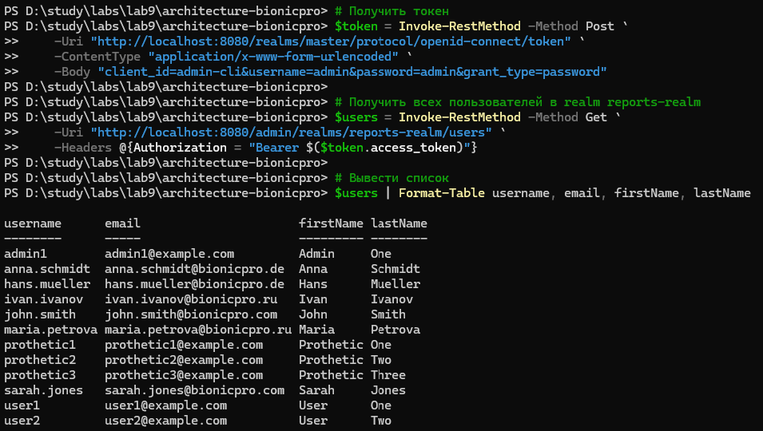
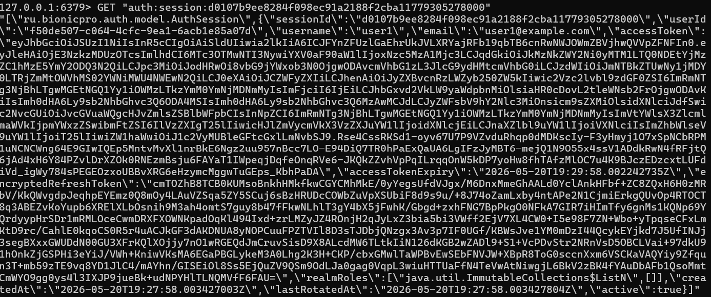
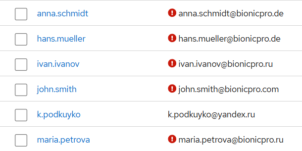

## Пояснения к работе

В данном проекте в etl-процессе в качестве хранилища телеметрии 
использовалась база данных postgresql, в качестве данных из CRM
использовался файл customers.csv
Это допущение было сделано для того, чтобы показать именно сборку
из двух разных источников, а построение лишней инфраструктуры было бы
избыточным. Основной причиной является невозможность поднятия всей
структуры на домашнем ноутбуке. Поэтому некоторые куски системы 
проходили тестирование отдельно друг от друга.
Для CDC процесса использовались данные из таблицы crm.users в postgresql
keycloak_db.
Это допущение было сделано для того, чтобы не поднимать лишние базы данных.
Авторизоваться лучше под пользователем 'maria.petrova', т.к. у неё есть роль
REPORTS_USER, необходимая для получения доступа к микросервису bionicpro-reports,
есть данные в clickhouse (без статистики, т.к. изначально по заданию не было ясно,
что это будет нужно. Поэтому и airflow как отдельный docker-compose лежит) и ldap.
Сами микросервисы были разработаны с нарушением паттернов проектирования
в угоду быстрой разработки решения как mvp.

Я учёл предыдущее замечание. Схема находится в файле
[bionicpro_etl_cdc.drawio](bionicpro_etl_cdc.drawio)

### Пользователи с ролью REPORTS_USER и доступом к мс bionicpro-reports

В схему помимо etl-процесса включил bionicpro-reports сервис, s3, cdn и
необходимые компоненты для обеспечения cdc-процесса.


## Некоторые нужные команды (Powershell):

#### Остановить контейнеры
```
docker-compose down
```

#### Запустить заново
```
docker-compose up --build
```

### посмотреть сессии в Redis:

#### Зайти в контейнер Redis
```
docker exec -it bionicpro-redis sh
```

#### Внутри контейнера запустить redis-cli
```
redis-cli
```

#### Посмотреть все ключи
```
KEYS *
```

#### Посмотреть конкретную сессию (замените на ваш ключ)
```
GET "auth:session:ed4ca0615e1a41a2b6e651ab9b6afa621779305004954"
```

#### Посмотреть все сессии
```
SCAN 0 MATCH "auth:session:*"
```

#### Выйти из redis-cli
```
exit
```

#### Выйти из контейнера
```
exit
```


### LDAP

#### Запустить
```
docker-compose up -d openldap
```

#### Проверить логи
```
docker-compose logs -f openldap
```

#### Проверить пользователей
```
docker exec bionicpro-ldap ldapsearch -x -D "cn=admin,dc=bionicpro,dc=com" -w admin -b "ou=People,dc=bionicpro,dc=com" -s sub
```

#### Проверить группы
```
docker exec bionicpro-ldap ldapsearch -x -D "cn=admin,dc=bionicpro,dc=com" -w admin -b "ou=Groups,dc=bionicpro,dc=com" -s sub
```

#### Проверить аутентификацию
```
docker exec bionicpro-ldap ldapwhoami -x -D "uid=john.smith,ou=USA,ou=People,dc=bionicpro,dc=com" -w password
```


### Keycloak проверка пользователей


#### Получить токен
```
$token = Invoke-RestMethod -Method Post `
    -Uri "http://localhost:8080/realms/master/protocol/openid-connect/token" `
-ContentType "application/x-www-form-urlencoded" `
-Body "client_id=admin-cli&username=admin&password=admin&grant_type=password"
```

#### Получить всех пользователей в realm reports-realm
```
$users = Invoke-RestMethod -Method Get `
    -Uri "http://localhost:8080/admin/realms/reports-realm/users" `
-Headers @{Authorization = "Bearer $($token.access_token)"}
```

#### Вывести список
```
$users | Format-Table username, email, firstName, lastName
```

#### Конфигурация MFA для существующих пользователей:

#### Получить токен
```
$token = Invoke-RestMethod -Method Post `
    -Uri "http://localhost:8080/realms/master/protocol/openid-connect/token" `
-ContentType "application/x-www-form-urlencoded" `
-Body "client_id=admin-cli&username=admin&password=admin&grant_type=password"
```

#### Получить всех пользователей
```
$users = Invoke-RestMethod -Method Get `
    -Uri "http://localhost:8080/admin/realms/reports-realm/users" `
-Headers @{Authorization = "Bearer $($token.access_token)"}
```

#### Добавить required action CONFIGURE_TOTP
```
foreach ($user in $users) {
$userId = $user.id

    # Текущие required actions
    $currentActions = $user.requiredActions
    
    # Добавить CONFIGURE_TOTP если нет
    if ($currentActions -notcontains "CONFIGURE_TOTP") {
        $currentActions += "CONFIGURE_TOTP"
        $updateBody = @{ requiredActions = $currentActions } | ConvertTo-Json
        
        Invoke-RestMethod -Method Put `
            -Uri "http://localhost:8080/admin/realms/reports-realm/users/$userId" `
            -Headers @{
                Authorization = "Bearer $($token.access_token)"
                "Content-Type" = "application/json"
            } `
            -Body $updateBody
    }
    
    Write-Host "✅ MFA configured for: $($user.username)" -ForegroundColor Green
}
```

#### Проверьте, какие данные возвращает userinfo
```

$code = "YOUR_CODE"  # из URL после редиректа

$body = @{
    grant_type = "authorization_code"
    code = $code
    client_id = "acdf984aae63467a83b7cecee975d20"
    client_secret = "0d3ff9ad9d074944b38d546be920fc58"
    redirect_uri = "http://localhost:8080/realms/reports-realm/broker/yandex/endpoint"
}

$userInfo = Invoke-RestMethod -Method Get -Uri "https://login.yandex.ru/info" -Headers @{Authorization = "Bearer $($token.access_token)"}

$userInfo | ConvertTo-Json -Depth 5
```


Структура S3
```
reports-bucket/
├── user_001/
│   ├── 2026-05-27/
│   │   ├── report_2026-05-27.json
│   │   ├── report_2026-05-27.xml
│   │   └── report_2026-05-27.csv
│   ├── 2026-05-26/
│   └── latest.json
├── user_002/
└── ...
```
На данный момент реализация была упрощена до генерации только xml,
но предусмотрена возможность генерации в разных форматах

#### minio console:
```
http://localhost:9006/login
login: minioadmin
password: minioadmin123
```

### Работа с s3 и nginx

#### Установить публичный доступ на весь bucket
```
docker exec bionicpro-minio-init mc anonymous set download local/reports-bucket
```

#### 1. Проверить, что Nginx может писать в кеш
```
docker exec bionicpro-cdn ls -la /var/cache/nginx/
```

#### 2. Проверить права на папку кеша
```
docker exec bionicpro-cdn sh -c "touch /var/cache/nginx/test.txt && echo 'Writable' || echo 'Not writable'"
```

#### 3. Посмотреть логи Nginx на наличие ошибок
```
docker logs bionicpro-cdn --tail 50
```

#### 4. Проверить конфигурацию Nginx внутри контейнера
```
docker exec bionicpro-cdn cat /etc/nginx/nginx.conf
```


### Команды для секции cdc

#### Проверить статус коннектора
```
curl http://localhost:8084/connectors/postgres-crm-connector/status
```

#### Список всех топиков (должен быть crm.users)
```
docker exec bionicpro-kafka kafka-topics.sh --list --bootstrap-server localhost:9092
```

#### Посмотреть сообщения в топике (должны быть данные пользователей)
```
docker exec bionicpro-kafka kafka-console-consumer.sh --bootstrap-server localhost:9092 --topic crm.users --from-beginning --max-messages 5
```

#### Проверить, что таблица crm_users заполнена
```
docker exec bionicpro-clickhouse clickhouse-client --database=reports_db --query "SELECT user_id, full_name, updated_at FROM crm_users LIMIT 5"
```

#### Проверить количество записей
```
docker exec bionicpro-clickhouse clickhouse-client --database=reports_db --query "SELECT COUNT(*) FROM crm_users"
```


### Пользователи ldap в keycloak



### Детали сессии в redis



### Пользователи с ролью REPORTS_USER и доступом к мс bionicpro-reports

