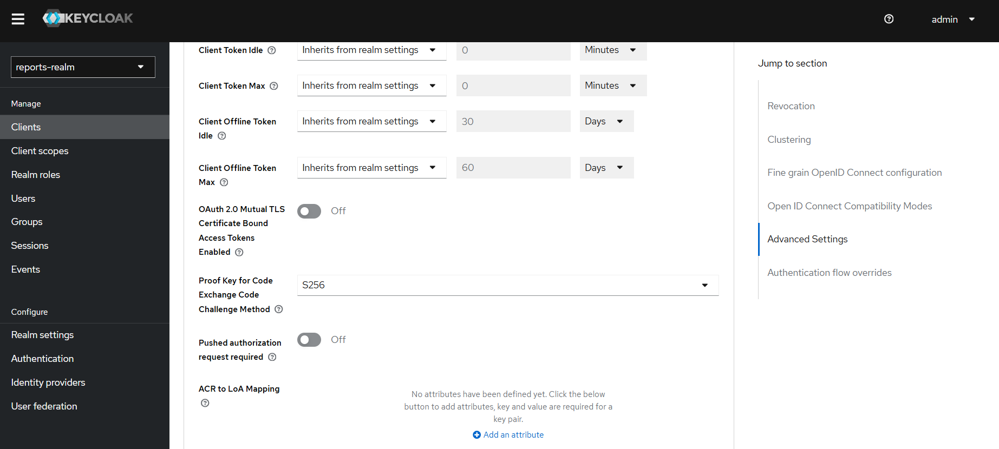
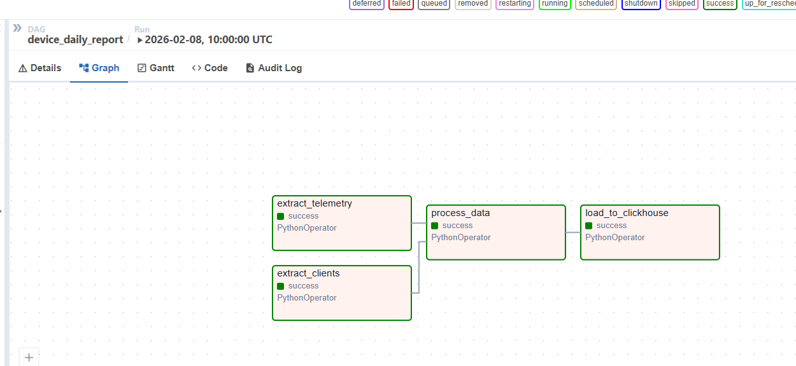
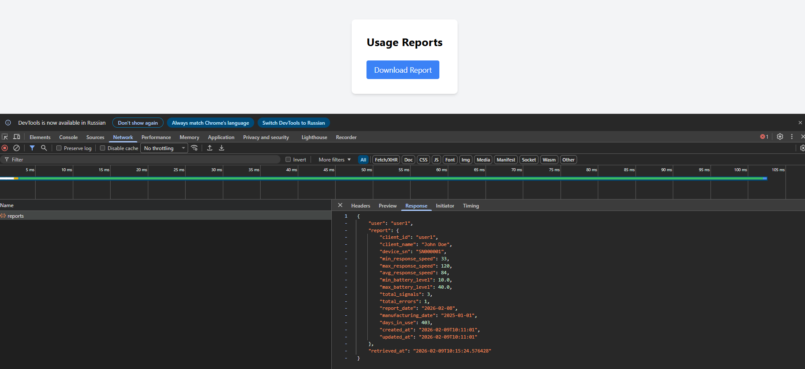

# Задание 1. Повышение безопасности системы

## Задача 1. Требования и решения

| **№** | **Требование**                                                                                                                                                                                                                                                                  | **Предлагаемое решение**                                                                                                                                              |
|:-----:|:--------------------------------------------------------------------------------------------------------------------------------------------------------------------------------------------------------------------------------------------------------------------------------|-----------------------------------------------------------------------------------------------------------------------------------------------------------------------|
|   1   | Унификацию доступа в системе BionicPRO. Это будет осуществляться через запрос данных учётных записей из внешнего источника, который расположен в стране представительства компании. Принципы локального хранения персональной и медицинской информации не должны быть нарушены. | Предлагается использовать Keycloak как Identity Broker. Предлагается добавить в архитектуру приложения API-Gateway с обязательной аутентификацией запросов к backend. |
|   2   | Безопасную схему работы с access- и refresh-токенами, которая исключает передачу фронтенду токенов, которые были получены от IdP.                                                                                                                                               | Предлагается использовать Reference Tokens в Keycloak                                                                                                                 |
|   3   | Возможность поддержки аутентификации пользователей через различные внешние удостоверяющие службы, действующие в разных странах.                                                                                                                                                 | Предлагается использовать Identity Federation. Для каждой страны подключается IdP, которые соблюдают требования местного законодательства.                            |


## Задача 2. Замена Code Grant на PKCE

В realm-export.json добавлены атрибуты для reports-frontend:

```
"attributes": {
"pkce.code.challenge.method": "S256",
"require.pkce": "true"
}
``` 



В фронтенд добавлены изменения:

```
const initOptions: KeycloakInitOptions = {
  pkceMethod: 'S256',
  onLoad: 'check-sso',
  checkLoginIframe: false
};
```

# Задание 2. Разработка сервиса отчётов

## Задача 1. Создать архитектуру решения для подготовки и получения отчётов


Решение использует Apache Airflow для извлечения данных из БД CRM и БД с данными от устройств.
Данные сохраняются в структурированном виде в витрину для отчетов OLAP БД Clickhouse.
Отчет строится на основе данных из витрины.

## Задача 2. Разработать Airflow DAG и настроить его на запуск по расписанию

### Исходные данные:

CRM система, таблица client_info:

| Поле               | Описание                  |
|:-------------------|:--------------------------|
| client_id          | id клиента                |
| client_name        | ФИО клиента               |
| email              | email клиента             |
| country            | Страна клиента            |
| manufacturing_date | Дата производства протеза |
| device_model       | Название модели           |
| device_sn          | серийный номер протеза    |

API телеметрия, таблица device_telemetries:

| Поле                | Описание                           |
|:--------------------|:-----------------------------------|
| device_sn           | серийный номер протеза             |
| started_at          | время начала события               |
| response_speed      | Время реакции от получения сигнала |
| myodensor_id        | Миосенсор                          |
| myodensor_value     | Значение миосенсора                |
| actuator_id         | Актуатор                           |
| actuator_value      | Значение актуатора                 |
| battery_level       | Уровень заряда батареи             |
| battery_temperature | Температура батареи                |

### Витрина для отчета:

Отчеты по использованию, витрина user_daily_report:

| Поле               | Описание                          |
|:-------------------|:----------------------------------|
| client_id          | id клиента                        |
| client_name        | Имя клиента                       |
| device_sn          | серийный номер протеза            |
| min_response_speed | Минимальное время реакции         |
| max_response_speed | Максимальное время реакции        |
| avg_response_speed | Среднее время реакции             |
| min_battery_level  | минимальный уровень батареи       |
| max_battery_level  | Максимальный уровень батареи      |
| total_signals      | Всего сигналов                    |
| total_errors       | Всего ошибок                      |
| report_date        | Дата на которую сформирован отчет |
| manufacturing_date | Дата производства протеза         |
| days_in_use        | Дней в использовании              |

### Поднимаем и настраиваем airflow

1. Запустить docker-compose up -d
2. Перейти в админ панель airflow http://localhost:8081 (admin/admin)
3. Добавить соединения БД

- Соединение с CRM БД:
    - Conn Id: pg_clients
    - Conn Type: Postgres
    - Host: crm_db
    - DB: crm_db
    - Login: crm_db
    - Password: crm_db
    - Port: 5432
- Соединение с API БД:
    - Conn Id: pg_telemetry
    - Conn Type: Postgres
    - Host: api_db
    - DB: api_db
    - Login: api_db
    - Password: api_db
    - Port: 5432

4. Запустить выполение DAG
   

## Задача 3. Создайте бэкенд-часть приложения для API.

Бэкенд разворачивается в отдельном docker-контейнере reports-api.
Реализован метод reports, который извлекает данные из витрины в clickhouse

Для тестирования использовать пользователей user1 и user4/

## Задача 4. Реализуйте ограничение доступа к эндпоинту отчётности.

Данные получаются по токену пользователя после его валидации в keycloak.
Из токена пользователя извлекается preferred_username, по нему производится фильтрация витрины по client_id (из CRM)

## Задача 5. Добавьте в UI кнопку получения отчёта и вызова эндпоинта его генерации.

