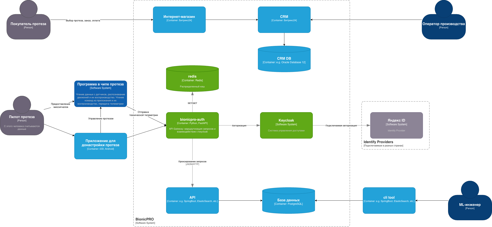
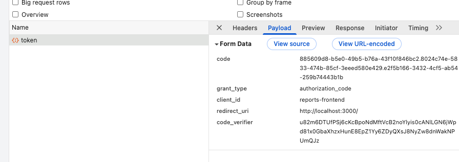
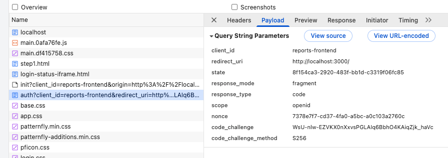
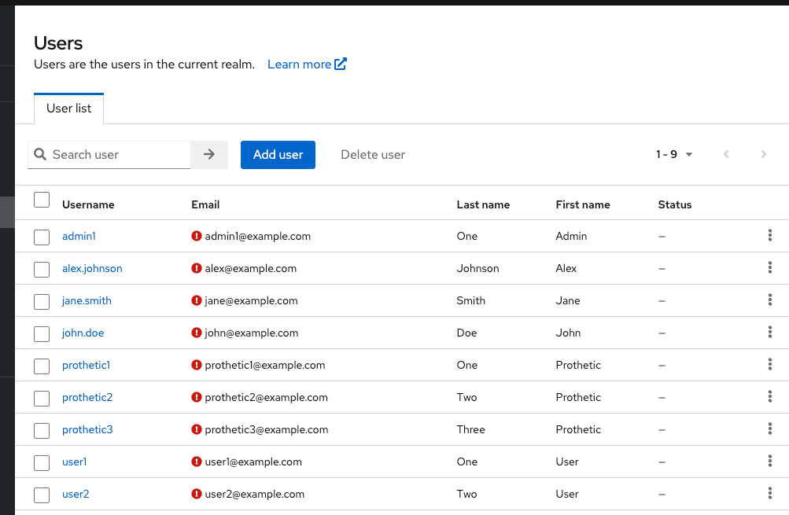
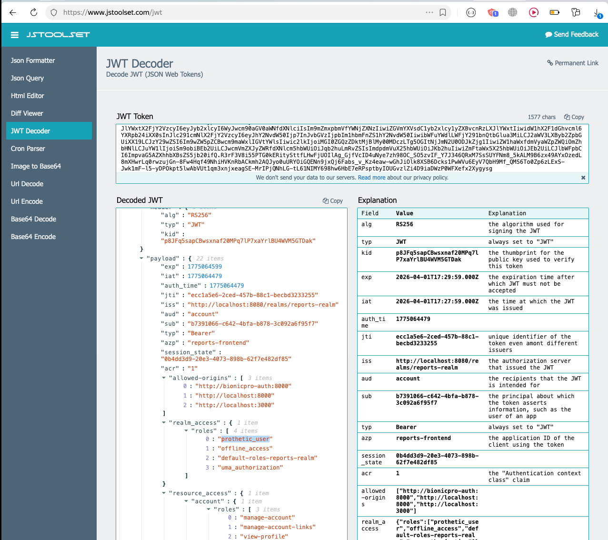
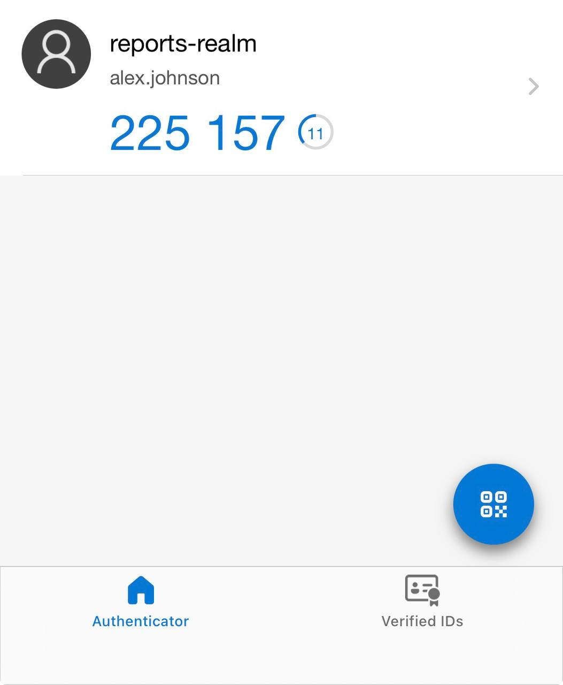

# Задание 1. Повышение безопасности системы

## Задача 1. Доработка диаграммы C4

На схему были добавлены:

- **bionicpro-auth** - сервис на Python, который выступает в роли API Gateway. Берёт на себя задачу обработки сессий 
и проксирования запросов в другие системы. В реальном приложении это мог бы быть Kong.
- **redis** - распределенный кеш, который хранит access- и refresh- токены. 
- **keycloak** - система, для управления доступом и аутентификацией.
- **Яндекс ID** - внешняя удостоверяющая служба.

## Задача 2. Замена Code Grant на PKCE

Процесс:
- Была добавлена настройка на frontend;
- Был настроен keycloak через UI; 
- Нужные настройки были экспортированы и добавлены в realm-export.json.

Результаты проверки:

## Задача 3. Безопасное хранение токенов и сессии

Было:
- реализовано backend-сервис (bionicpro-auth);
- добавлен Redis для хранения сессий;
- перенастроен Keycloak;
- переписана логика работы фронта на работу с сессиями;

Итоговый результат представлен на диаграмме:
[diagram.puml](diagram.puml)

## Задача 4. LDAP

После синхронизации юзеры:

Токен (расшифровка):

## Задача 5. Настройка MFA

Настроил через microsoft authenticator

