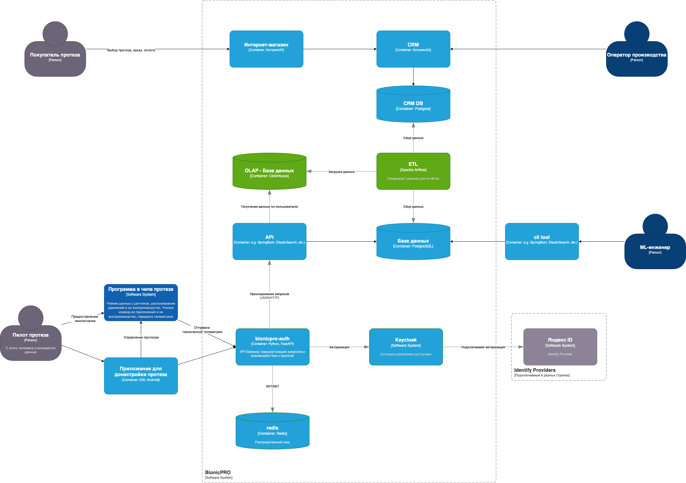
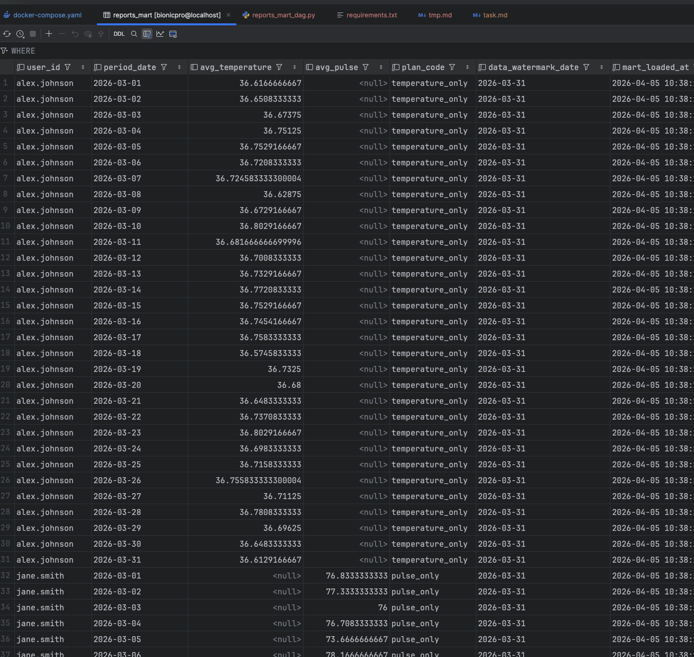
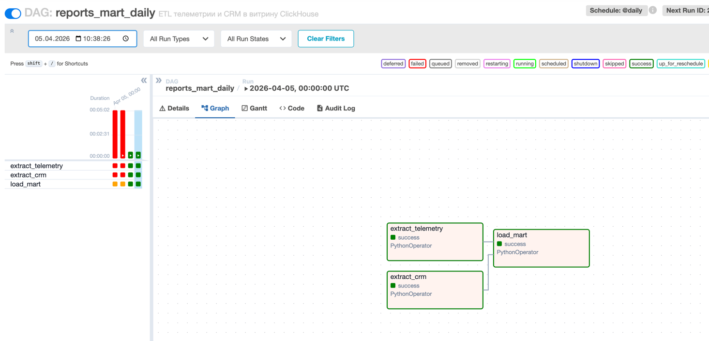
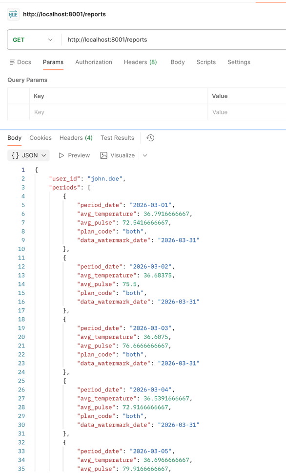

# Задание 2. Разработка сервиса отчётов

## Задача 1. Архитектура решения

### Теоретическая архитектура



### Практическая архитектура

Для выполнения задания я добавлю следующие системы:

- **API DB (Postgres).** В данной БД будут храниться температура и пульс пользователя
в определенное время. Данные будут синтетическими и сгенерированными.

- **CRM DB (Postgres).** В CRM будет содержаться информация о данных тарифа пользователя. 
Он может включать только пульс, только температуру или и то и то.

- **OLAP DB (Click House).** В данную базу будут собираться данные из других
баз для создания консолидированных отчётов.

- **ETL (Apache Airflow).** Контейнер, который будет перегружать данные из одних баз в другие.

- **API.** Сервис API будет возвращать данные из ClickHouse в виде средней 
температуры и среднего пульса пользователей в виде json файла.

В существующих системах:

- **bionicpro-auth.** Добавлю похода в сервис API после авторизации.

- **frontend.** подключу выгрузку отчёта в виде json файла.

## Задача 2. Реализация витрины данных

Был добавлен airflow и реализован DAG. Скриншоты работы:

Витрина данных полученная в кликхаусе:


Схема dag-а:


## Задача 3. Бекенд-приложение для API

Проверка:
```
curl -sS -H "X-User-Id: john.doe" http://localhost:8001/reports
```


