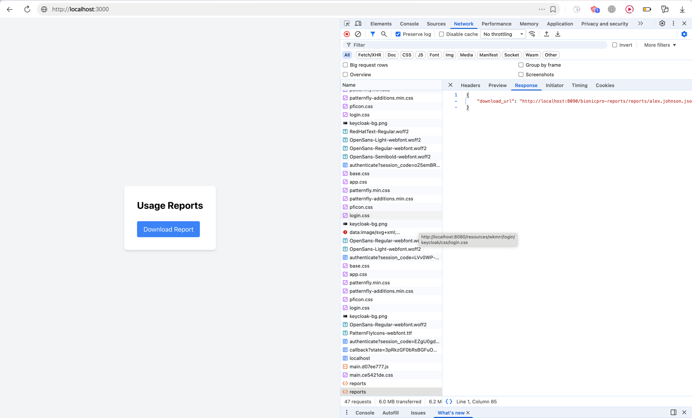
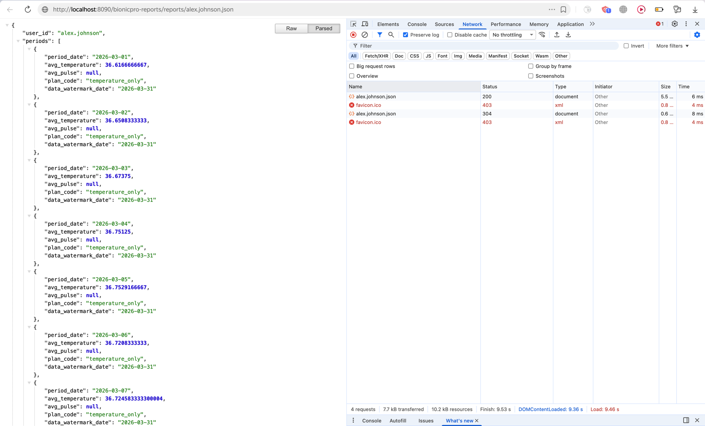

# Задание 3. Снижение нагрузки на базу

Флоу был переработан - теперь возвращается ссылка отчёт json файл.

Первый запрос - без кеша, второй - перезагрузка страницы

Стратегия сброса кеша: 
- он так или иначе сбросится в течение суток, а отчёты генерируются раз в сутки;
- дополнительно был реализован даг для сброса кеша при генерации;