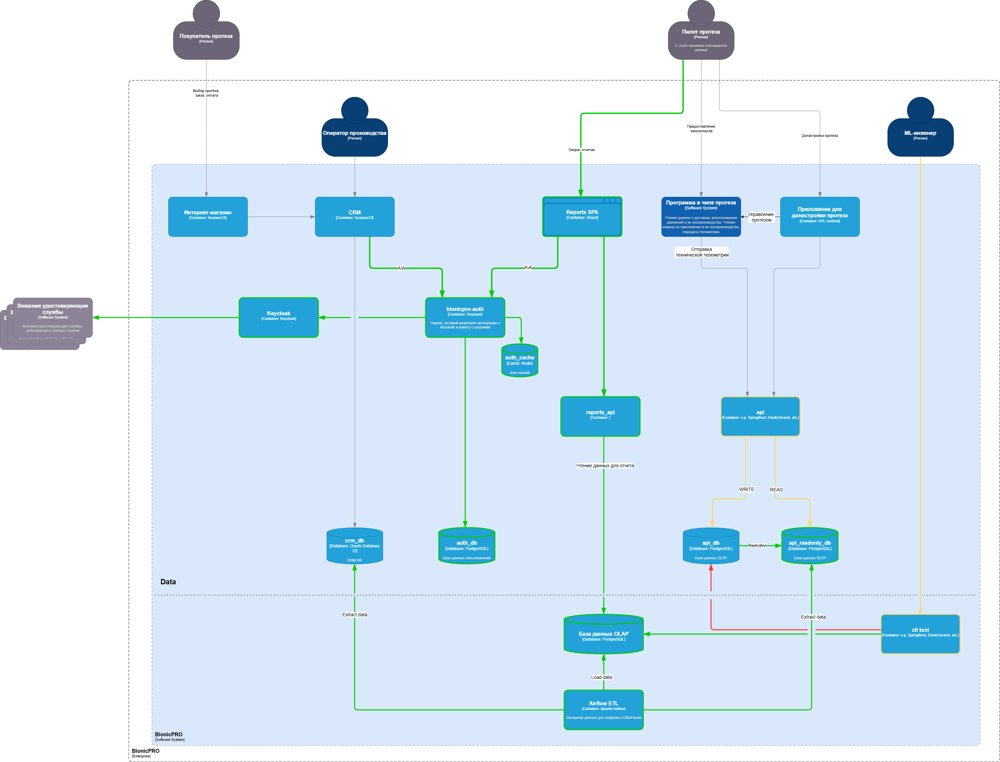

# Задание 1. Повышение безопасности системы

## Задача 1. Предложите архитектурное решение и доработайте диаграмму C4 для управления учётными данными пользователя. 

### Унификация доступа
### Возможность поддержки аутентификации пользователей через различные внешние удостоверяющие службы
### Разделение на OLTP и OLAP для производительности и работы с большим объемом данных

## Архитектурное решение представлено на схеме.

