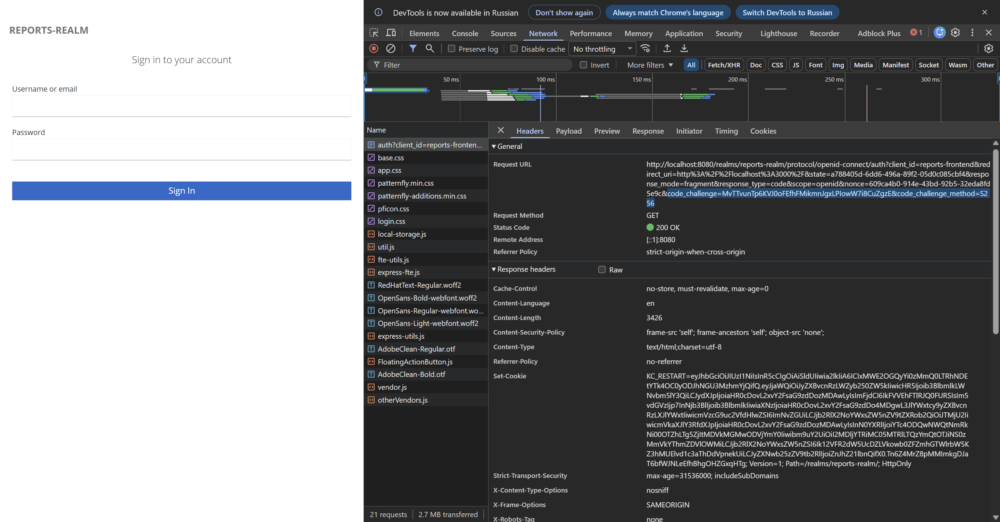
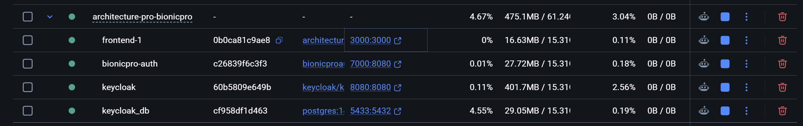
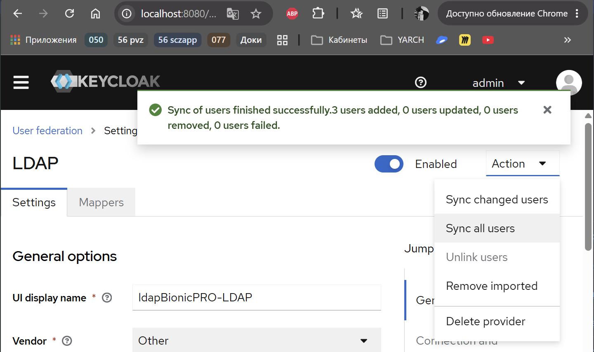
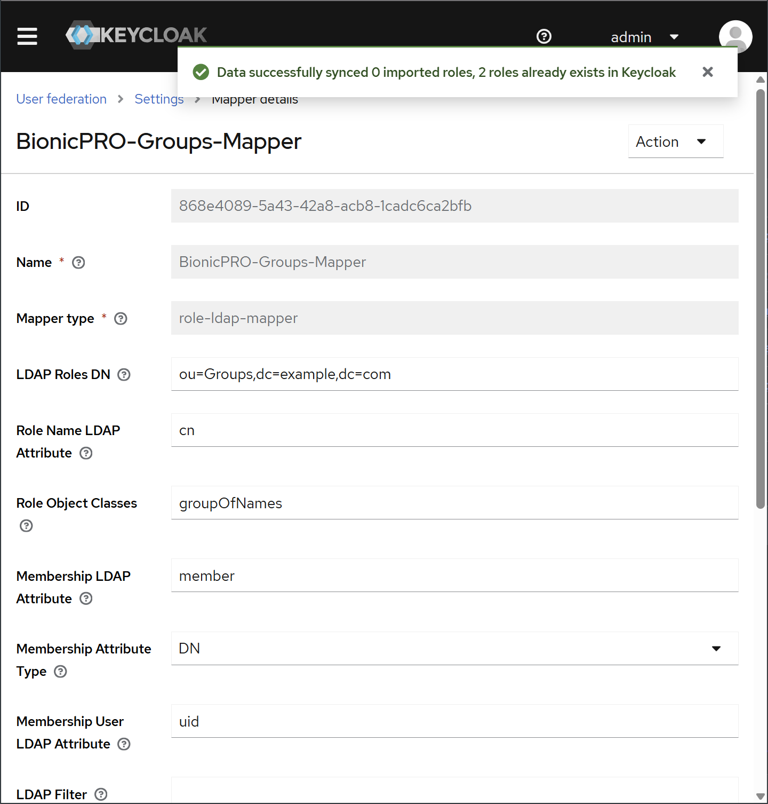
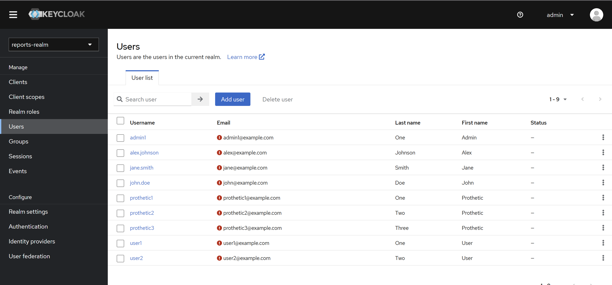

# Задание 1. Повышение безопасности системы

## Задача 1. Предложите архитектурное решение и доработайте диаграмму C4 для управления учётными данными пользователя. 

- Унификация доступа
- Возможность поддержки аутентификации пользователей через различные внешние удостоверяющие службы
- Разделение на OLTP и OLAP для производительности и работы с большим объемом данных

## Архитектурное решение представлено на схеме.

## Задача 2. Улучшите безопасность существующего приложения, заменив Code Grant на PKCE. 

- в reports-realm (файл `realm-export.json`), для клиента `reports-frontend` добавлен атрибут `"pkce.code.challenge.method": "S256"`.
- в App.tsx в `ReactKeycloakProvider` добавлено использование `pkceMethod: "S256"`

Для проверки правильной настройки PKCE, откроем инструменты разработчика и посмотрим на Query String Parameters (параметры URL) запроса http://localhost:8080/realms/reports-realm/protocol/openid-connect/auth 

Там обязательно должны присутствовать два параметра:
`code_challenge=Кредо-строка-хэша...`
`code_challenge_method=S256`

Можно увидеть появление `code_challenge` и `code_challenge_method`:
`code_challenge=MvTTvunTp6KVJ0oFEfhFMikmnJgxLPIowW7i8CuZgzE`
`code_challenge_method=S256`

## Задача 3. Обеспечьте безопасное получение и хранение access-и refresh-токенов. 
- разработан сервис bionicpro-auth на языке C# с учетом требований. 

запуск через docker-compose:
    В директории bionicpro-auth docker-compose звпускает сервис `bionicpro-auth` + `keycloack`
    В корневом каталоге docker-compose звпускает сервис `frontend` + `bionicpro-auth` + `keycloack`

## Задача 4. Обеспечьте безопасное получение и хранение access-и refresh-токенов. 
- развернут LDAP-сервер OpenLDAP. 
Crhbgn для загрузки пользователей `Get-Content ./ldap/ldif/config.ldif -Raw | docker exec -i openldap ldapadd -x -D "cn=admin,dc=example,dc=com" -w admin`
- настроен Keycloak, чтобы он ходил в LDAP-сервер за авторизацией пользователей.
- добавлен маппинг ролей для синхронизации ролей разных представительств BionicPRO.

## Задача 5. Настройте MFA.
- настроен в Keycloak механизм OTP-аутентификации.
- настроен обязательный ввод одноразового пароля для всех пользователей.

Измененный экспорт настроек keycloack залит в репозиторий.

## Задача 6. Добавьте OAuth 2.0 от Яндекс ID.
- реализована аутентификацию пользователей через внешний Identity Provider Яндекс ID. 
- создано приложение, настроен экспорт

Измененный экспорт настроек keycloack залит в репозиторий.