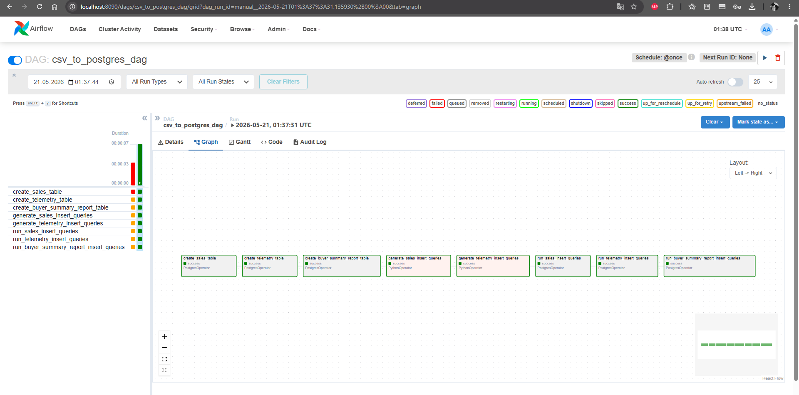

# Задание 2. Повышение безопасности системы

## Задача 1. Создать архитектуру решения для подготовки и получения отчётов.

- Архитектурное решение представлено на схеме из первого задания.

## Задача 2. Разработать Airflow DAG и настроить его на запуск по расписанию.
- реализован ETL-процесс с использованием Airflow.

- спроектирована витрина для быстрой генерации отчета

