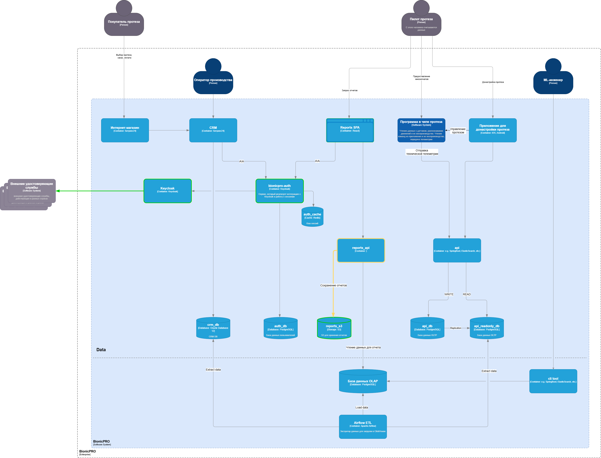

# Задание 3. Повышение безопасности системы

## Архитектурное решение представлено на схеме.

 - добавлен в reports сервис реализацию записи сформированных отчётов в объектное хранилище, поддерживающее S3 API (Ceph, Minio), с учетом требований

